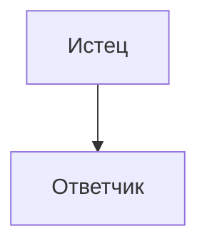

## Квалификация
Квалификация спора изложена.

## Схема сторон

```mermaid
graph TD
  A[Истец] --> B[Ответчик]
```

## Анализ
Ключевые аргументы и доказательства.

## Выводы
Резюме по делу.

READY_FOR_DOCX: analytical
